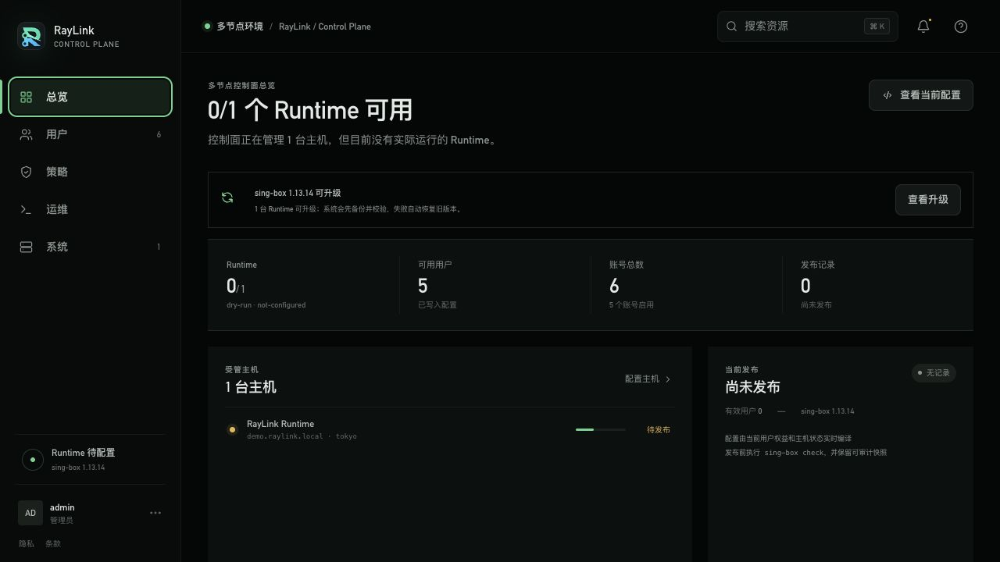
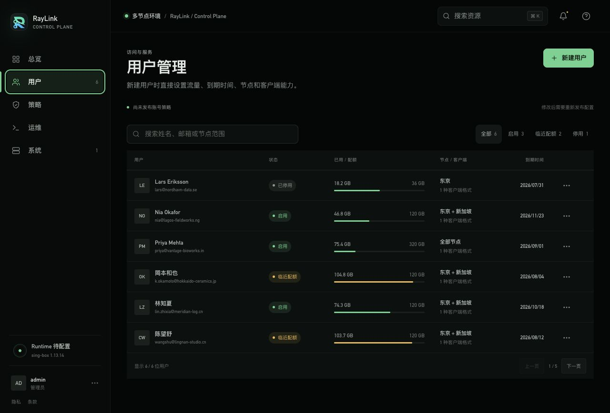
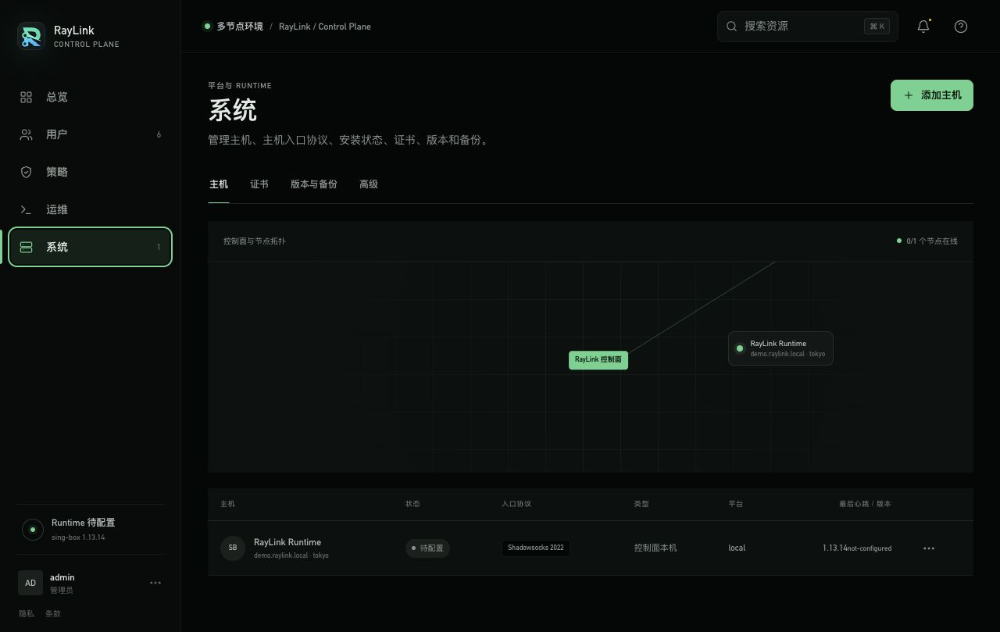
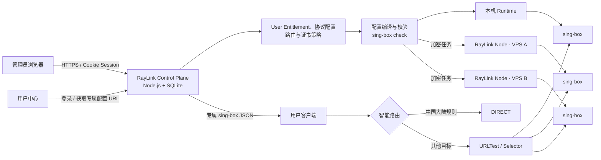
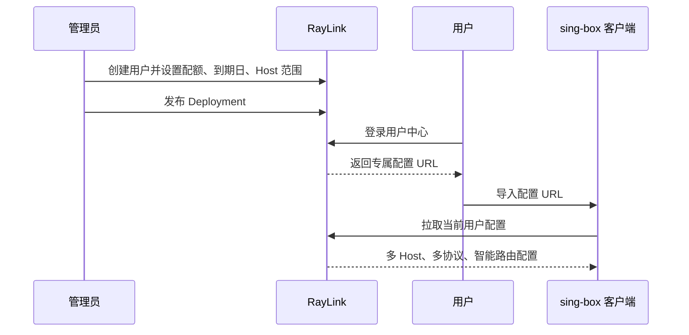

<div align="center">
  
  <h1>RayLink</h1>
  <p><strong>把多用户、多 Host sing-box 服务变成一套可安装、可配置、可发布、可计量的控制面。</strong></p>
  <p>
    <a href="https://github.com/Zanetach/RayLink/releases"></a>
    
    
    
  </p>
</div>



RayLink 面向自建服务和团队内部网络管理：管理员在 Web 控制台创建用户、设置流量与到期时间、接入 VPS、配置 Host 入口协议并发布；用户登录独立用户中心，获取包含多个 Host 和协议的专属 sing-box 客户端配置。国内目标直连，其他流量进入自动测速与故障切换策略。

> [!IMPORTANT]
> RayLink 是网络基础设施管理软件。请只在你有权管理的服务器和网络中部署，并遵守所在地法律、云服务商条款及目标服务的使用政策。

## 为什么选择 RayLink

| 能力 | RayLink 的处理方式 |
|---|---|
| 一台控制面管理多台 VPS | 本机 Runtime 与远程 RayLink Node 使用同一套 Host、协议和 Deployment 模型 |
| User Entitlement 与客户端配置 | 创建用户时直接设置流量、到期时间和 Host 范围；无需额外的可复用权益模板 |
| 一个客户端配置包含多个 Host | 按 User Entitlement 编译全部可用 Host 和协议，并生成 URLTest、Selector 与故障切换 |
| Host 入口协议 | 协议绑定到具体 Host，按需启用；保存后经过能力、端口、TLS 与语法校验 |
| 智能路由 | sing-box 客户端通过 TUN、DNS 分流、CN 规则直连和境外自动代理执行 |
| 安全发布 | `sing-box check`、原子替换、版本快照、失败恢复和历史回滚 |
| 真实流量计量 | 使用 sing-box 用户级统计，不以 Host 网卡总流量估算用户配额 |
| Host 可观测性 | 汇总 CPU、内存、上下行速率、服务状态、心跳和 Runtime 版本 |
| 在线升级 | 发现已验证的 sing-box 新版本后提示升级，失败自动恢复旧二进制和服务状态 |

## 界面预览

### 用户即 User Entitlement

创建用户时直接设置配额、到期日和 Host 范围；停用、到期或超额后，RayLink 会重新编译并发布撤权 Deployment。



### 协议绑定 Host

每台 Host 独立维护入口协议和 Runtime 状态。新 VPS 通过一次性接入令牌安装 RayLink Node，在线后即可参与客户端配置编译和 Deployment。



## 架构



核心数据流：

1. 管理员修改 User Entitlement、Host 或协议。
2. 控制面按每台 Host 生成候选配置，并执行版本、构建标签、端口、TLS 和 `sing-box check` 校验。
3. 本机使用原子文件替换；远程 RayLink Node 领取加密任务并在 Host 本地校验、发布和重启。
4. 用户客户端配置按当前 User Entitlement 聚合多个 Host 与协议，自动加入智能路由、测速和故障切换。
5. RayLink Node 回传心跳、Host 资源遥测、Runtime 状态和用户级流量增量。

## 一键安装

当前发布安装包面向 **Debian/Ubuntu + systemd + AMD64（x86_64）**。在生产验收清单全部通过前，应视为候选版本。准备一台全新 VPS，并开放：

- Caddy 自动 HTTPS 需要的 `80`
- 控制台 HTTPS 端口 `443`
- 你在界面启用的代理协议端口

> [!NOTE]
> Caddy 初始化功能当前位于 `main`，需要在下一个 Release 发布后才能通过下面的版本化命令安装；现有 v0.2.0 发布包不包含本次切换。

服务器需要预先具备 `curl`。使用 root 登录时，直接复制执行这一条命令：

```bash
bash -o pipefail -c 'curl -fsSL https://github.com/Zanetach/RayLink/releases/download/v0.2.0/install.sh | bash'
```

普通用户登录时，把管道中的 `bash` 改为 `sudo bash`：

```bash
bash -o pipefail -c 'curl -fsSL https://github.com/Zanetach/RayLink/releases/download/v0.2.0/install.sh | sudo bash'
```

脚本会检测公网 IP，下载固定的 AMD64 发布包及 SHA-256，校验后解压，再执行系统安装。
若需要指定公网 IP：

```bash
bash -o pipefail -c 'curl -fsSL https://github.com/Zanetach/RayLink/releases/download/v0.2.0/install.sh | bash -s -- --public-ip 203.0.113.10'
```

一键安装会自动完成：

- 安装并校验 Node.js 22
- 安装预编译的 sing-box 1.13.14 计量版 Runtime
- 配置 RayLink、HTTPS 入口与 systemd 自启动
- 为 IP 首次访问生成本机证书
- 输出仅显示一次、30 分钟有效的初始化地址

打开安装器输出的 `https://服务器IP/setup#token=...`。选择域名时，先将域名的 A/AAAA
记录直接解析到该 VPS（初始化时不要启用 CDN 代理），再填写域名和证书通知邮箱。RayLink
会核对解析目标，由 Caddy 自动申请并续期证书，并在受信任 HTTPS 实际可用后完成初始化；
同时保留 IP 恢复入口。没有域名时继续使用 IP HTTPS。首次使用 IP 证书时，浏览器会提示
本机签发；继续前请核对安装器打印的 SHA-256 证书指纹。

完整部署、Caddy、手动安装和令牌轮换说明见 [部署手册](roms/deploy/README.md)。

## 添加第二台 VPS

第一台 Host 同时运行控制面和本机 Runtime。新增 Host 不需要再次安装完整控制台：

1. 打开「系统 → 主机 → 添加 Host」。
2. 填写 Host 名称、公网地址和区域，生成一次性安装命令。
3. 在新 VPS 上执行该命令；它会安装 RayLink Node 和审批版本的 sing-box Runtime。
4. 等待 RayLink Node 显示在线，在 Host 详情中启用所需协议。
5. 前往「运维」检查候选配置并发布。

接入令牌只能使用一次。RayLink Node 身份、加密私钥和受管配置分别保存在受限目录中；控制面不会以明文任务或日志下发 TLS 私钥。

## 从 User Entitlement 到客户端配置



配置 URL 的密钥按密码处理：服务端只保存 SHA-256 哈希，重置后旧地址立即失效；响应使用私有缓存策略和 ETag。用户停用、到期、超额或 Host 范围变化后，下一次更新会取得新的有效配置。

## 协议与路由

RayLink 的协议目录来自安装 Runtime 的 `version + platform + build tags`，不会把“sing-box 源码中存在”误标成“当前 Host 可用”。

| 类型 | 当前界面能力 |
|---|---|
| 公网用户协议 | Shadowsocks 2022、VMess、VLESS、Trojan、Naive、AnyTLS、Hysteria、TUIC、Hysteria 2 |
| 组合与传输 | 证书 TLS、Reality、HTTP、WebSocket、QUIC、gRPC、HTTPUpgrade |
| 私有入口 | SOCKS、HTTP Proxy、Mixed |
| 高级/系统入口 | ShadowTLS、Direct、TUN、Redirect、TProxy |
| 客户端策略 | TUN、DNS 劫持、CN 直连、URLTest 自动测速、Selector 手选和故障切换 |

完整的 inbound、outbound、endpoint、构建标签与平台限制见 [sing-box 协议支持矩阵](roms/docs/sing-box-protocol-support.md)。

## 本地开发

要求 Node.js 22.5+。没有 sing-box 也可以使用 `dry-run` 查看和开发控制台；安装 sing-box 后可执行真实配置校验。

```bash
git clone https://github.com/Zanetach/RayLink.git
cd RayLink/roms
npm start
```

默认访问 [http://127.0.0.1:4173](http://127.0.0.1:4173)，仅限本机开发的初始凭据：

```text
用户名：admin
密码：Admin@2026
```

生产模式会拒绝使用该默认密码。项目不加载 `.env` 文件；需要直接导出环境变量，或由 systemd `EnvironmentFile` 注入：

```bash
RAYLINK_ADMIN_PASSWORD='replace-with-a-long-random-secret' \
RAYLINK_DATA_DIR='/var/lib/raylink' \
RAYLINK_PROXY_HOST='node.example.com' \
SING_BOX_BIN='/usr/local/bin/raylink-sing-box' \
npm start
```

运行自动化生产前检查。`check:production` 需要 PATH 中有 sing-box 1.13.14 与 OpenSSL；
它覆盖代码回归、协议语法和短时内存烟测，但不替代干净 VPS、真实客户端、故障注入与
72 小时运行验收：

```bash
npm run check
npm run check:production
```

## 关键配置

| 环境变量 | 默认值 | 用途 |
|---|---:|---|
| `RAYLINK_HOST` | `127.0.0.1` | 控制面监听地址 |
| `RAYLINK_PORT` | `4173` | 控制面端口 |
| `RAYLINK_PUBLIC_ORIGIN` | 按监听地址生成 | 浏览器实际使用的 HTTPS Origin |
| `RAYLINK_TRUST_PROXY` | `false` | 仅在可信反向代理后设为 `true` |
| `RAYLINK_DATA_DIR` | `./data` | SQLite、快照和受管配置目录 |
| `RAYLINK_RUNTIME_MODE` | `dry-run` | `dry-run` 或 `systemd` |
| `RAYLINK_USER_METERING` | `true` | 保留用户级流量统计能力 |
| `RAYLINK_CADDYFILE` | `/etc/caddy/Caddyfile` | 首次初始化受管 Caddy 配置 |
| `RAYLINK_ENV_FILE` | `/etc/raylink/raylink.env` | 域名切换后持久化正式入口 |
| `SING_BOX_BIN` | `sing-box` | 受管 sing-box 可执行文件 |
| `SING_BOX_SYSTEMD_UNIT` | `sing-box.service` | 发布后重启的 systemd 服务 |

生产环境必须让 RayLink 只监听回环地址，并由 Caddy 提供 HTTPS；不要向公网直接开放 `4173`。
`/sub/` URL 包含配置 URL 密钥，RayLink 生成的 Caddyfile 默认不开启访问日志。

## 当前边界

v0.2.0 已覆盖单控制面、多 Host、用户客户端配置、安全发布和真实流量计量的核心链路。以下功能仍在后续范围：

- TLS 证书到期告警与 DNS 提供商 API 集成
- 配置 URL 二维码与 Mihomo 格式转换
- 财务账单、周期重置、退款和人工调账
- 多 Host 灰度升级与维护窗口
- 同一种协议的多个独立 inbound 实例
- 完整 outbound、endpoint、DNS 和路由规则图形化编辑器
- 邮件邀请、忘记密码、2FA 与细粒度 RBAC

## 项目资料

- [应用源码说明](roms/README.md)
- [生产部署手册](roms/deploy/README.md)
- [sing-box 协议支持矩阵](roms/docs/sing-box-protocol-support.md)
- [生产落地计划](roms/docs/release/raylink-production-implementation-plan.md)
- [v0.2.0 生产候选验收记录](roms/docs/release/v0.2.0-production-acceptance.md)
- [领域模型](roms/CONTEXT.md)
- [架构决策记录](roms/docs/adr/)
- [v0.2.0 发布说明](roms/docs/release/v0.2.0.md)
