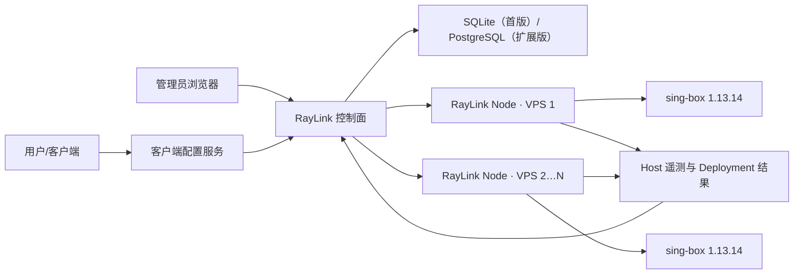

# RayLink 正式版落地实施方案

版本基线：RayLink 0.1 → 正式版

sing-box 基线：1.13.14

审查日期：2026-07-26

## 1. 发布结论

当前代码已经形成“控制面、User Entitlement、Host、协议配置、配置校验、本机/远程 Deployment、用户中心”的基础闭环，并已补充 Host CPU、内存、网络和 Runtime 状态。

当前已补齐正式商用前最后两条核心技术链路：远程 TLS 私钥密封分发，以及基于
`with_v2ray_api` 的真实按用户流量计量。代码层面的发布阻断已经解除，但仍必须完成干净 VPS、
真实客户端、故障注入和长期运行验收后才能标记正式生产版本。

OpenAI、Google、X/Twitter、Facebook、YouTube 应作为部署后的连通性探测目标，不应作为永久可用承诺。可用性还取决于 VPS 网络、出口 IP 信誉、目标服务地区政策、账户状态和客户端网络环境。

## 2. 正式版目标

管理员应能完成：

1. 在第一台服务器一键部署 RayLink 控制面、RayLink Node 和 sing-box。
2. 在界面生成一次性命令，把第二台及后续 VPS 接入控制面。
3. 创建用户，并直接设置有效期、流量额度、可用 Host 和启停状态。
4. 从推荐模板或高级模式创建多个 sing-box 协议配置。
5. 预览、校验、发布配置，并看到每台 Host 的 Deployment 结果与回滚状态。
6. 查看 Host 在线状态、CPU、内存、网络、Runtime 状态、版本和配置版本。

用户应能完成：

1. 登录用户中心，或使用专属客户端配置 URL 导入受支持客户端。
2. 自动获取本人可用 Host、协议和智能路由配置。
3. 国内私网和国内网站直连，其他流量进入代理选择器。
4. 在多个健康 Host 之间自动测速选择，也可手工切换。
5. 用户停用、到期或配置 URL 重置后，旧凭据及时失效。

## 3. 生产架构



职责边界：

- 控制面：User Entitlement、协议模板、Host、证书资产、Deployment、客户端配置 URL、审计。
- RayLink Node：安装检查、OS 遥测、证书落盘、`sing-box check`、原子发布、服务重启、失败回滚。
- sing-box：真实代理协议、认证、路由执行；不承担用户数据库和账单数据库职责。
- 客户端配置：TUN、DNS、防泄漏、国内直连、境外代理、selector/urltest。

## 4. 已实现能力

| 能力 | 当前状态 | 正式版判定 |
|---|---|---|
| 管理员登录、用户 CRUD | 已实现 | 可用 |
| User Entitlement：到期、流量额度、Host 范围 | 已实现 | 真实字节计量、跨 Host 累计和超额撤权已贯通 |
| 多 Host 接入与一次性令牌 | 已实现 | 需干净 VPS 验收 |
| RayLink Node 心跳和远程任务 | 已实现 | 0.7.0 支持协议端口、防火墙、监听及 Hysteria/TUIC 专用外部探针；旧版暂停领任务并提示升级 |
| CPU、内存、网络、服务遥测 | 已实现 | 需长期稳定性验收 |
| sing-box 固定版本安装 | 已修正为 1.13.14 | 需 Ubuntu/Debian 实机验收 |
| sing-box 在线升级 | 已实现 | 官方稳定版检查、同系列兼容门禁、二进制备份、配置校验、健康检查和自动回滚 |
| 避免双 systemd 服务冲突 | 已实现 | 安装器只保留 RayLink 托管服务 |
| `sing-box check`、原子替换、失败恢复 | 已实现 | 需远程故障注入验收 |
| 多协议配置与 Runtime Credential | 已实现 | 已按 Host 的版本、平台和 build tags 精确限制 |
| 稳定配置 URL、重置吊销、用户中心复制 | 已实现 | 二维码尚未实现 |
| TUN、DNS、国内直连、自动选路 | 已实现 | 1.13.14 校验通过；带内置基线与控制面托管完整规则 |
| TLS 资产分发 | 已实现 | RayLink Node 专属密封、证书密钥校验、`0600` 原子写入和失败恢复 |
| 自动按用户流量计量 | 已实现 | 需 `with_v2ray_api` 计量版 Runtime；缺失时界面明确告警 |

## 5. 智能路由落地

智能路由必须生成在客户端配置中，服务器端保持“认证后直连出站”。

### 5.1 客户端基础结构

- `tun` inbound：捕获 TCP/UDP 系统流量。
- `mixed` inbound：保留给不方便使用 TUN 的手工系统代理模式。
- `dns-local`：解析国内域名，直接访问。
- `dns-remote`：经代理访问 DoH/DoT，避免境外域名本地 DNS 泄漏。
- 每个“Host × 协议”生成一个唯一 outbound。
- `urltest`：自动检测可用 Host。
- `selector`：包含“自动选择”和所有手工 Host。
- `direct`：国内、私网和用户自定义直连规则。

### 5.2 路由优先级

1. `sniff` 识别协议和域名。
2. DNS 流量执行 `hijack-dns`。
3. 私网 IP 直接访问。
4. 管理员自定义拒绝、直连、代理规则。
5. 中国域名 rule-set 直接访问。
6. 中国 IP rule-set 直接访问。
7. 最终规则进入代理 selector。

当前实现将 SagerNet rule-set 固定到明确提交并校验 SHA-256，由 RayLink 控制面缓存和同源托管。
完整缓存未准备好时，客户端使用内置中国域名/DNS 基线规则，不包含任何远程 rule-set，因此首次
启动不依赖 GitHub；缓存准备完成后，客户端配置自动切换到完整二进制规则集。

### 5.3 客户端交付

第一正式版优先支持 sing-box 原生 JSON；Mihomo 作为第二格式单独实现和验收，不能只改响应头或文件后缀。各平台客户端必须明确说明：

- TUN 所需系统权限；
- 导入、更新和删除客户端配置 URL 的方法；
- TUN 不可用时 mixed 系统代理的能力边界；
- DNS 与本地网络例外设置。

## 6. User Entitlement 与客户端配置模型

User 与 User Entitlement 继续一对一合并管理，无需额外的可复用权益模板。

每个用户直接拥有：

- 状态、到期时间、流量额度；
- 可用 Host/区域；
- 可用协议能力；
- 登录密码；
- 隐藏的运行凭据；
- 一个稳定的配置 URL 标识和可重置的配置 URL 密钥。

当前客户端配置接口（API 路径保留 `subscription`）：

```text
GET /sub/{public-id}/{secret}/sing-box.json
POST /api/users/{id}/subscription/rotate
POST /api/portal/subscription/rotate
```

要求：

- 配置 URL 密钥仅保存哈希，不能明文写入数据库或日志。
- 用户中心可生成、复制和重置配置 URL；二维码与管理员代重置后的安全交付仍待补充。
- 用户停用或到期后返回明确的 403，不继续下发 Runtime Credential。
- 重置配置 URL 不必自动重置 Runtime Credential；两类操作分别确认。
- 当前响应使用 ETag 与 `Cache-Control: private, no-cache`：客户端可用 304 节省流量，
  但每次更新都必须向服务端重新验证，确保配置 URL 重置立即生效；不得被公共 CDN 缓存。
- 客户端配置只包含当前用户的 Runtime Credential 和授权 Host。

## 7. 协议配置设计

界面不把 sing-box 的所有类型平铺成同等难度，而分三层：

### 一键启用

- Shadowsocks
- VMess + Reality
- VLESS + Reality
- Trojan / AnyTLS + Reality
- Naive + 自动 TLS
- Hysteria / TUIC / Hysteria2 + 自动 TLS 和 UDP 防火墙

### 仅本机服务

- SOCKS
- HTTP
- Mixed

这些入口固定监听 `127.0.0.1`，不会自动开放公网端口，也不会加入远程用户订阅。

### 高级协议

- ShadowTLS
- TUN
- Redirect
- TProxy
- Direct

一键启用事务自动选择空闲端口、生成 Runtime Credential/Reality 密钥、绑定节点域名证书、配置 TCP/UDP 防火墙、运行 `sing-box check`、原子发布、检查监听和公网连接，并在任何失败时恢复配置与 RayLink 新增的防火墙规则。远程节点发现系统端口冲突时会在本机扫描并回报下一个空闲候选端口，控制面只重试该端口。Hysteria、TUIC 与 Hysteria2 会进一步生成一次性客户端配置，通过真实协议握手访问 `RAYLINK_PROTOCOL_PROBE_URL`；只有握手与外部 HTTP 请求同时成功才进入“公网可用”状态。

后续增强需支持同一协议创建多个实例，实例标识作为 inbound tag，端口必须做跨协议、跨实例冲突校验。保存前按目标 Host 校验：

- sing-box 版本；
- 平台与架构；
- `with_quic`、`with_gvisor`、`with_acme` 等 build tags；
- 证书/Reality/Transport 组合；
- 防火墙端口和 UDP/TCP 要求。

WireGuard 在 1.13 应使用 endpoint，不得生成已移除的 WireGuard outbound。1.14 的 Snell、Bridge、Cloudflared 不能出现在 1.13.14 正式版能力声明中。

## 8. TLS 与敏感资产

已实现的证书分发流程：

1. 控制面在发布时读取协议配置指向的本地证书和私钥，验证 X.509 有效期及密钥匹配。
2. 每个 RayLink Node 本地生成 X25519 密钥对，私钥只保存在 Host 的 `0600` 状态文件。
3. 控制面使用临时 X25519、HKDF-SHA256 和 AES-256-GCM 生成 RayLink Node 专属密封包；任务数据库不保存明文私钥。
4. 配置按 Host 改写为 `/var/lib/raylink-node/sing-box/tls/releases/<证书指纹>/` 不可变受管路径。
5. RayLink Node 执行任务时重新检查证书有效期和密钥匹配，先完整写入新版本资产，再以原子配置切换启用；中途崩溃不会改变旧配置引用的证书对。
6. 发布成功后只保留当前配置与上一份回滚配置引用的 TLS 版本，清理更旧私钥。
7. API、日志和任务结果只展示资产数量、证书指纹/有效期元数据和错误摘要。

本机节点域名由 Caddy 自动签发和续期，远程节点使用 sing-box `with_acme`。RayLink Node 会同时维护协议端口，以及 ACME HTTP-01 / TLS-ALPN-01 所需的 TCP 80/443 防火墙规则；证书到期告警仍是后续增强项。

Reality 私钥同样按敏感资产处理，控制面 API 默认不回显。

## 9. 发布编排与回滚

每次发布建立一个全局 Deployment，并为每台 Host 建立 Deployment target：

```text
pending → validating → publishing → active
                            └──────→ failed → rolling_back → rolled_back
```

流程：

1. 控制面按 Host 编译候选配置和资产清单。
2. RayLink Node 检查版本、build tags、磁盘、端口和资产。
3. RayLink Node 对临时文件运行 `sing-box check`。
4. 原子替换配置，重启唯一的 RayLink 托管 sing-box 服务。
5. 检查 systemd active、监听端口和健康探测。
6. 成功后回传 checksum；失败自动恢复上一版本。
7. 所有目标 Host 结果聚合后，控制面才将全局 Deployment 标记为 active/partial/failed。

正式版需保留至少 20 个 Deployment 版本，并支持按 Host 回滚。默认先灰度一台 Host，再批量发布其余 Host。

## 10. 流量统计方案

### 正式计量链路

- Linux 不执行远程 root 安装脚本；只从审批清单中的官方固定源码构建包含 `with_v2ray_api` 的受控二进制，版本对应 Go Module 校验值固定并通过 checksum database 验证。
- V2Ray API 只监听 `127.0.0.1`。
- RayLink Node 周期性读取 user 计数器，上报累计值、唯一 sample ID 和 systemd InvocationID，不重置 Runtime 内存计数。
- 控制面按“Host + Runtime 实例 + 用户 + 方向”计算增量，持久化精确字节账本，处理重启归零、跨 Host 汇总、重复采集和离线恢复。
- 用户累计用量长期保留；高频原始样本和逐次明细默认保留 30 天，按日/Host 汇总保留 400 天，避免 SQLite 与 WAL 无限增长。超过 7 天的陈旧样本会被拒绝，防止清理后重放造成重复计量。
- 达到额度后撤销授权并触发配置发布。
- Runtime 安装和升级都校验 `with_v2ray_api`，避免在线升级后静默丢失计量能力。
- 缺少该 build tag 的 Host 不会生成估算用量；界面根据真实样本和错误上报显示“等待样本、健康、数据中断、采集故障、能力缺失”。

该账本可作为访问配额依据；若要生成财务账单，还需另行实现周期结算、退款、人工调账审批和账单审计。

## 11. 运维与安全

- 控制面仅监听内网或 `127.0.0.1`，由 HTTPS 反向代理暴露。
- RayLink Node 与控制面之间强制 HTTPS；生产禁止 HTTP 接入命令。
- 管理员强密码，关闭开发默认密码，增加登录限速与审计。
- RayLink Node 密钥、配置 URL 密钥和 Runtime Credential 均只保存哈希或加密值。
- 数据库和证书资产每日备份，定期做恢复演练。
- 防火墙只开放管理 HTTPS 和已启用协议端口。
- Clash API、V2Ray API 不得无认证监听公网。
- Host 离线、CPU/内存过高、Runtime 停止、Deployment 失败和证书临期触发告警。

## 12. 分阶段实施

| 阶段 | 交付 | 预计研发时间 |
|---|---|---:|
| A | 当前遥测、版本修正、安装服务冲突修复、发布审查 | 已完成 |
| B | 正式配置 URL/吊销、TUN + DNS + 智能路由生成 | 主链路已完成；二维码与离线规则集待完成 |
| C | 证书资产安全分发 | 已完成；本机 Caddy 与远程 ACME 自动签发已接通，同协议多实例待增强 |
| D | 多 Host Deployment 聚合、灰度、远程版本回滚、告警 | 5–7 人日 |
| E | 干净 VPS、各协议、各客户端、故障与安全验收 | 5–8 人日 |
| F | 自建 `with_v2ray_api` 构建与按用户持久计量 | 已完成主链路；待长期压力与故障验收 |

基础正式版还需约 20–31 人日；一名熟悉 Node.js、Linux 网络和 sing-box 的工程师约 4–6 周，两名工程师并行约 2.5–4 周。时间不包含域名备案、VPS 采购和第三方客户端审核。

## 13. 正式发布验收清单

- [ ] Ubuntu 22.04/24.04、Debian 12 干净 VPS 一键安装通过。
- [ ] 安装版本确认为 1.13.14，系统仅有一个受管 sing-box 服务运行。
- [ ] 第二台 VPS 可一次性接入、上报遥测、接收配置并失败回滚。
- [ ] VLESS + Reality、Trojan + TLS、Hysteria2 完成真实端到端连接。
- [x] 所有界面可创建协议均已通过本机 sing-box 1.13.14 的 `sing-box check`；目标 Linux Host 仍需实机复验。
- [x] 用户创建、停用、到期、配额和凭据重置已有自动化测试验证会在 Runtime 配置中生效。
- [ ] 稳定配置 URL 可导入、更新、吊销，二维码内容与 URL 一致。
- [ ] TUN 模式下私网和中国网站直连，境外目标走代理。
- [ ] DNS 劫持、防泄漏、rule-set 缓存和更新失败回退通过。
- [ ] selector 手工选择、urltest 自动选择和 Host 故障切换通过。
- [ ] OpenAI、Google、X/Twitter、Facebook、YouTube 完成当前出口的连通性探测并记录结果。
- [x] TLS 私钥不出现在 API、日志、任务结果和普通数据库导出中；任务库只含 RayLink Node 专属密文。
- [ ] 用量采集在 Runtime 重启、Host 离线、重复上报和跨 Host 并发场景完成 72 小时故障验收。
- [ ] 配置错误、Runtime 启动失败、Host 断网、控制面重启均完成故障演练。
- [ ] 管理接口、RayLink Node 接口、客户端配置接口完成鉴权、限速和日志脱敏检查。
- [ ] 备份可恢复，发布版本可回滚。

以上清单全部通过后，才建议把版本标记为可生产发布。
