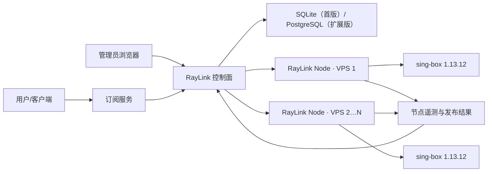

# RayLink 正式版落地实施方案

版本基线：RayLink 0.1 → 正式版

sing-box 基线：1.13.12

审查日期：2026-07-26

## 1. 发布结论

当前代码已经形成“控制面、用户、主机、协议配置、配置校验、本机/远程发布、用户中心”的基础闭环，并已补充节点 CPU、内存、网络和 sing-box 服务状态。

但当前仍是 **正式版候选基础，不满足完整正式发布条件**。智能路由和稳定订阅主链路已经实现，
以下两项仍是发布阻断项：

1. TLS 证书文件只保存路径，没有安全分发到远程主机；跨主机发布 Trojan、AnyTLS、Naive 等 TLS 协议可能因缺少证书失败。
2. 当前流量用量由外部写入，没有自动、持久、按用户的计量链路，因此不能承诺流量配额会自动准确扣减。

OpenAI、Google、X/Twitter、Facebook、YouTube 应作为部署后的连通性探测目标，不应作为永久可用承诺。可用性还取决于 VPS 网络、出口 IP 信誉、目标服务地区政策、账户状态和客户端网络环境。

## 2. 正式版目标

管理员应能完成：

1. 在第一台服务器一键部署 RayLink 控制面、RayLink Node 和 sing-box。
2. 在界面生成一次性命令，把第二台及后续 VPS 接入控制面。
3. 创建用户，并直接设置有效期、流量额度、可用节点和启停状态。
4. 从推荐模板或高级模式创建多个 sing-box 协议配置。
5. 预览、校验、发布配置，并看到每台主机的发布结果与回滚状态。
6. 查看节点在线状态、CPU、内存、网络、sing-box 服务、版本和配置版本。

用户应能完成：

1. 登录用户中心，或使用专属订阅地址导入受支持客户端。
2. 自动获取本人可用节点、协议和智能路由配置。
3. 国内私网和国内网站直连，其他流量进入代理选择器。
4. 在多个健康节点之间自动测速选择，也可手工切换。
5. 用户停用、到期或订阅重置后，旧凭据及时失效。

## 3. 生产架构



职责边界：

- 控制面：用户权益、协议模板、主机、证书资产、配置版本、订阅、审计。
- RayLink Node：安装检查、OS 遥测、证书落盘、`sing-box check`、原子发布、服务重启、失败回滚。
- sing-box：真实代理协议、认证、路由执行；不承担用户数据库和账单数据库职责。
- 客户端配置：TUN、DNS、防泄漏、国内直连、境外代理、selector/urltest。

## 4. 已实现能力

| 能力 | 当前状态 | 正式版判定 |
|---|---|---|
| 管理员登录、用户 CRUD | 已实现 | 可用 |
| 用户到期、流量额度、节点范围 | 已实现 | 权益可用，流量自动采集未实现 |
| 多主机接入与一次性令牌 | 已实现 | 需干净 VPS 验收 |
| RayLink Node 心跳和远程任务 | 已实现 | 0.4.0 支持任务租约和 Runtime 在线升级；旧版暂停领任务并提示升级 |
| CPU、内存、网络、服务遥测 | 已实现 | 需长期稳定性验收 |
| sing-box 固定版本安装 | 已修正为 1.13.12 | 需 Ubuntu/Debian 实机验收 |
| sing-box 在线升级 | 已实现 | 官方稳定版检查、同系列兼容门禁、二进制备份、配置校验、健康检查和自动回滚 |
| 避免双 systemd 服务冲突 | 已实现 | 安装器只保留 RayLink 托管服务 |
| `sing-box check`、原子替换、失败恢复 | 已实现 | 需远程故障注入验收 |
| 多协议配置与用户凭据 | 已实现基础版 | 需按节点 build tags 精确限制 |
| 稳定订阅 URL、重置吊销、用户中心复制 | 已实现 | 二维码尚未实现 |
| TUN、DNS、国内直连、自动选路 | 已实现 | 1.13.12 校验通过；带内置基线与控制面托管完整规则 |
| TLS 资产分发 | 未实现 | TLS 协议发布阻断 |
| 自动按用户流量计量 | 未实现 | 不能宣称自动配额 |

## 5. 智能路由落地

智能路由必须生成在客户端订阅配置中，服务器端保持“认证后直连出站”。

### 5.1 客户端基础结构

- `tun` inbound：捕获 TCP/UDP 系统流量。
- `mixed` inbound：保留给不方便使用 TUN 的手工系统代理模式。
- `dns-local`：解析国内域名，直接访问。
- `dns-remote`：经代理访问 DoH/DoT，避免境外域名本地 DNS 泄漏。
- 每个“主机 × 协议”生成一个唯一 outbound。
- `urltest`：自动检测可用节点。
- `selector`：包含“自动选择”和所有手工节点。
- `direct`：国内、私网和用户自定义直连规则。

### 5.2 路由优先级

1. `sniff` 识别协议和域名。
2. DNS 流量执行 `hijack-dns`。
3. 私网 IP 直接访问。
4. 管理员自定义拒绝、直连、代理规则。
5. 中国域名 rule-set 直接访问。
6. 中国 IP rule-set 直接访问。
7. 最终规则进入代理 selector。

当前实现将 SagerNet rule-set 固定到明确提交并校验 SHA-256，由 RayLink 控制面缓存和同源托管。
完整缓存未准备好时，客户端使用内置中国域名/DNS 基线规则，不包含任何远程 rule-set，因此首次
启动不依赖 GitHub；缓存准备完成后，订阅自动切换到完整二进制规则集。

### 5.3 客户端交付

第一正式版优先支持 sing-box 原生 JSON；Mihomo 作为第二格式单独实现和验收，不能只改响应头或文件后缀。各平台客户端必须明确说明：

- TUN 所需系统权限；
- 导入、更新和删除订阅的方法；
- TUN 不可用时 mixed 系统代理的能力边界；
- DNS 与本地网络例外设置。

## 6. 用户与订阅模型

用户与订阅继续合并管理，不增加“方案管理”模块。

每个用户直接拥有：

- 状态、到期时间、流量额度；
- 可用主机/区域；
- 可用协议能力；
- 登录密码；
- 隐藏的运行凭据；
- 一个稳定的订阅标识和可重置的订阅密钥。

当前订阅接口：

```text
GET /sub/{public-id}/{secret}/sing-box.json
POST /api/users/{id}/subscription/rotate
POST /api/portal/subscription/rotate
```

要求：

- 订阅密钥仅保存哈希，不能明文写入数据库或日志。
- 用户中心可生成、复制和重置订阅；二维码与管理员代重置后的安全交付仍待补充。
- 用户停用或到期后返回明确的 403，不继续下发节点凭据。
- 重置订阅链接不必自动重置协议运行凭据；两类操作分别确认。
- 当前响应使用 ETag 与 `Cache-Control: private, no-cache`：客户端可用 304 节省流量，
  但每次更新都必须向服务端重新验证，确保订阅重置立即生效；不得被公共 CDN 缓存。
- 订阅内容只包含当前用户的凭据和授权节点。

## 7. 协议配置设计

界面不把 sing-box 的所有类型平铺成同等难度，而分三层：

### 推荐模板

- VLESS + Reality
- Trojan + TLS
- Hysteria2
- AnyTLS
- Naive

### 高级协议

- Shadowsocks
- VMess
- ShadowTLS
- TUIC
- Hysteria
- SOCKS
- HTTP
- Mixed

### 系统接入

- TUN
- Redirect
- TProxy
- Direct

正式版协议页需支持同一协议创建多个实例，实例标识作为 inbound tag，端口必须做跨协议、跨实例冲突校验。保存前按目标主机校验：

- sing-box 版本；
- 平台与架构；
- `with_quic`、`with_gvisor`、`with_acme` 等 build tags；
- 证书/Reality/Transport 组合；
- 防火墙端口和 UDP/TCP 要求。

WireGuard 在 1.13 应使用 endpoint，不得生成已移除的 WireGuard outbound。1.14 的 Snell、Bridge、Cloudflared 不能出现在 1.13.12 正式版能力声明中。

## 8. TLS 与敏感资产

新增“证书资产”模块：

1. 上传证书和私钥，或由受支持的 ACME 流程签发。
2. 私钥在控制面加密存储，数据库只保存资产 ID 和元数据。
3. 发布任务按主机下发所需资产，RayLink Node 以 `0600` 原子落盘。
4. 配置只引用节点本地的受管路径，不接受任意浏览器文件路径。
5. 证书到期前告警，续期失败保留上一张有效证书。
6. 任务响应只回传指纹、有效期和错误摘要，不回传私钥。

Reality 私钥同样按敏感资产处理，控制面 API 默认不回显。

## 9. 发布编排与回滚

每次发布建立一个全局 deployment，并为每台主机建立 deployment target：

```text
pending → validating → publishing → active
                            └──────→ failed → rolling_back → rolled_back
```

流程：

1. 控制面按主机编译候选配置和资产清单。
2. Node 检查版本、build tags、磁盘、端口和资产。
3. Node 对临时文件运行 `sing-box check`。
4. 原子替换配置，重启唯一的 RayLink 托管 sing-box 服务。
5. 检查 systemd active、监听端口和健康探测。
6. 成功后回传 checksum；失败自动恢复上一版本。
7. 所有目标主机结果聚合后，控制面才将全局发布标记为 active/partial/failed。

正式版需保留至少 20 个配置版本，并支持按主机回滚。默认先灰度一台节点，再批量发布其余节点。

## 10. 流量统计方案

### 基础正式版

- 使用官方 sing-box 1.13.12 二进制。
- 展示主机级 OS 网络流量趋势。
- 用户流量额度仅作为管理员维护字段，不宣传自动准确计量和自动封禁。

### 计量增强版

- 从官方 `v1.13.12` 固定源码构建包含 `with_v2ray_api` 的受控二进制。
- V2Ray API 只监听 `127.0.0.1`。
- RayLink Node 周期性读取 user/inbound/outbound 计数器，使用“节点 + 进程启动 ID + 用户 + 方向 + 序号”幂等上报增量。
- 控制面持久化累计值，处理重启归零、跨节点汇总、重复采集和离线恢复。
- 达到额度后撤销授权并触发配置发布。

第一正式版建议选择基础版，避免把未经长期验证的流量统计当作账单依据。

## 11. 运维与安全

- 控制面仅监听内网或 `127.0.0.1`，由 HTTPS 反向代理暴露。
- 节点与控制面之间强制 HTTPS；生产禁止 HTTP 接入命令。
- 管理员强密码，关闭开发默认密码，增加登录限速与审计。
- Node 密钥、订阅密钥和运行凭据均只保存哈希或加密值。
- 数据库和证书资产每日备份，定期做恢复演练。
- 防火墙只开放管理 HTTPS 和已启用协议端口。
- Clash API、V2Ray API 不得无认证监听公网。
- 节点离线、CPU/内存过高、服务停止、配置发布失败和证书临期触发告警。

## 12. 分阶段实施

| 阶段 | 交付 | 预计研发时间 |
|---|---|---:|
| A | 当前遥测、版本修正、安装服务冲突修复、发布审查 | 已完成 |
| B | 正式订阅 URL/吊销、TUN + DNS + 智能路由生成 | 主链路已完成；二维码与离线规则集待完成 |
| C | 证书资产安全分发、同协议多实例、节点能力精确校验 | 5–8 人日 |
| D | 多主机发布聚合、灰度、远程版本回滚、告警 | 5–7 人日 |
| E | 干净 VPS、各协议、各客户端、故障与安全验收 | 5–8 人日 |
| 可选 F | 自建 `with_v2ray_api` 构建与按用户持久计量 | 8–12 人日 |

基础正式版还需约 20–31 人日；一名熟悉 Node.js、Linux 网络和 sing-box 的工程师约 4–6 周，两名工程师并行约 2.5–4 周。时间不包含域名备案、VPS 采购和第三方客户端审核。

## 13. 正式发布验收清单

- [ ] Ubuntu 22.04/24.04、Debian 12 干净 VPS 一键安装通过。
- [ ] 安装版本确认为 1.13.12，系统仅有一个受管 sing-box 服务运行。
- [ ] 第二台 VPS 可一次性接入、上报遥测、接收配置并失败回滚。
- [ ] VLESS + Reality、Trojan + TLS、Hysteria2 完成真实端到端连接。
- [ ] 所有界面可创建协议均通过目标节点上的 `sing-box check`。
- [ ] 用户创建、停用、到期和凭据重置在运行配置中生效。
- [ ] 稳定订阅 URL 可导入、更新、吊销，二维码内容与 URL 一致。
- [ ] TUN 模式下私网和中国网站直连，境外目标走代理。
- [ ] DNS 劫持、防泄漏、rule-set 缓存和更新失败回退通过。
- [ ] selector 手工选择、urltest 自动选择和节点故障切换通过。
- [ ] OpenAI、Google、X/Twitter、Facebook、YouTube 完成当前出口的连通性探测并记录结果。
- [ ] TLS 私钥不出现在 API、日志、任务结果和普通数据库导出中。
- [ ] 配置错误、服务启动失败、节点断网、控制面重启均完成故障演练。
- [ ] 管理接口、Node 接口、订阅接口完成鉴权、限速和日志脱敏检查。
- [ ] 备份可恢复，发布版本可回滚。

以上清单全部通过后，才建议把版本标记为可生产发布。
